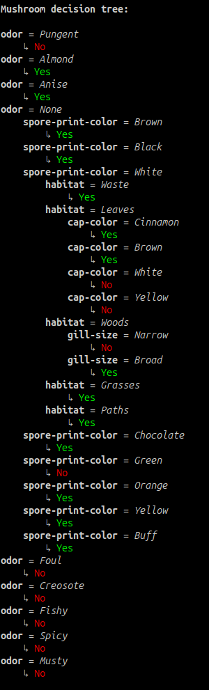

# Mushroom-decision-tree

Welcome to my first ever algorithmic project. This project implements a decision tree based on a given data set of 8000+ mushrooms found in the `mushrooms.csv` file. The file can be found directly in this repository (clearly it is a bad practice that I've learned from). Here is the output:

The different features of the project are listed below.

## Algorithm

### Parsing

The first step is the parsing of data found in the `mushrooms.csv` file. This is handled by the `load_dataset(path: str) -> list[Mushroom]` function. It loads every attribute associated to a mushroom into a Mushroom object.

### Objects and structure

In addition to functions, this project uses POO for the following elements:

 - **Mushroom:** contains a dictionary where the keys are the attributs that can be added with the help of a dedicated method.
 - **Node:** the name already states its role; a node in the decision tree. It contains methods to add new edges to it, to know if it is a leaf and to get the labels of the outgoing edges.
 - **Edge:** represents an edge of the decision tree. It contains the parent and child attributs to facilitate navigation through the tree as well as a label attribute.

### Decision tree building

Once the data is loaded, the program builds a decision tree recursively which uses concepts of **entropy** and **information gain** to select the best splitting attribute. 

The **entropy** of a set measures its disorder and randomness. The closer it is to 1, the more different are the objects in the set. It helps in understanding the complexity of data and is crucial in applications like data compression and machine learning, but this project doesn't go that far.

The **information gain** measures the reduction of entropy in the child sets if we split based on a selected attribute. The decision tree is built on this basis, choosing the splitting attribute with the highest information gain.

## Display and interaction

Once the information is loaded and the tree is build (which shouldn't take more than a second), it will be displayed with it's boolean expression just below.

The user then has access to a small interactive program below the displayed data. It works by entering some attributs of a mushroom to descend into the tree towards the leaves to determine its edibility.

## Tree to python

The program also builds a `to_python.py` file where the tree is retranscribed into python code.

## Tests

This project also contains a set of tests created usin the `unitest` module. In general, tests are very handy, especially in an algorithmic project where it can determine if the algorithm has a correct output based on different inputs.

## Report

Finally, the project contains a scientific report in french. I wrote it during my first year of bachelor so, looking back to is, it is pretty basic. The good thing is that I can compare it to newer reports I've done (such as the `Belgium Path Finder` or my different AI project reports) and see the improvements ! :sunglasses: 

